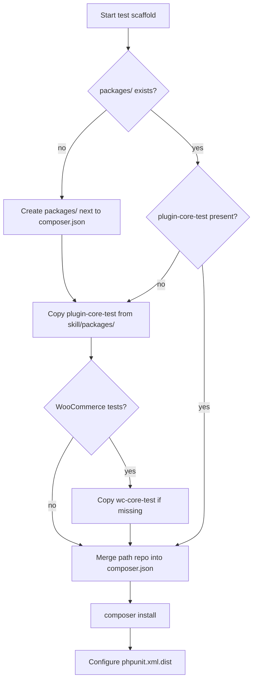

# Private wpdev packages

`wpdev/*` test packages are private and not available from public Composer. Bundle them locally via path repositories.

**Source of truth:** copy from this skill's `packages/` folder only — never from external paths or GitLab at runtime.

## Agent workflow (target plugin)

1. **Resolve skill root** — directory containing the loaded `SKILL.md` (not an absolute user path).
2. **Create `packages/`** next to the target plugin's `composer.json` if it does not exist.
3. **Copy idempotently:**
   - If `{plugin-root}/packages/plugin-core-test/composer.json` is missing → copy from `{skill-root}/packages/plugin-core-test/`
   - If WooCommerce tests are needed and `{plugin-root}/packages/wc-core-test/composer.json` is missing → copy from `{skill-root}/packages/wc-core-test/`
   - If a package already exists → skip (do not overwrite unless the user explicitly asks)
4. **Merge `composer.json`** (do not replace the entire file):
   - Add or update the path `repositories` block (below)
   - Remove private GitLab `repositories` entries that only served `wpdev/*`
   - Merge `require-dev` for copied packages
5. Run **`composer install`** only after `packages/` exists.
6. **WooCommerce:** when `wc-core-test` is added, also add `woocommerce/woocommerce.php` to `tests/plugins-list.php` and set `ACTIVE_PLUGINS` in `phpunit.xml.dist`.



## Path repository (required)

Add to the target `composer.json`:

```json
"repositories": [
  {
    "type": "path",
    "url": "packages/*",
    "options": {
      "monorepo": true,
      "symlink": false
    }
  }
]
```

## Full `composer.json` template (new plugin)

```json
{
  "repositories": [
    {
      "type": "path",
      "url": "packages/*",
      "options": {
        "monorepo": true,
        "symlink": false
      }
    }
  ],
  "autoload": {
    "psr-4": {
      "MyVendor\\MyPlugin\\": "./src/"
    }
  },
  "autoload-dev": {
    "psr-4": {
      "MyVendorTest\\MyPlugin\\": "./tests/unit-tests/"
    }
  },
  "require-dev": {
    "wpdev/plugin-core-test": "^1.2"
  },
  "scripts": {
    "tests": "phpunit",
    "tests:pre": "@php ./tests/patch/apply-patches.php"
  }
}
```

Add `"wpdev/wc-core-test": "^1.0"` to `require-dev` only when `wc-core-test` was copied.

## Existing `composer.json`

| Situation | Action |
|-----------|--------|
| No `repositories` | Add the path block above |
| GitLab repo for wpdev | Replace with path repo (private registry no longer needed) |
| Has `require-dev` | Merge `wpdev/plugin-core-test` (and `wc-core-test` if copied) |
| `packages/` already exists | Copy only missing packages |

## Bundled package reference

| Skill path | Composer name | Required |
|------------|---------------|----------|
| `packages/plugin-core-test/` | `wpdev/plugin-core-test` @ 1.2.1 | Yes |
| `packages/wc-core-test/` | `wpdev/wc-core-test` | WooCommerce only |

See [packages/README.md](../packages/README.md) for the manifest.

## Not supported

`wpdev/wp-test-tools` is not bundled — it requires `wpdev/console`, which is outside this skill.
